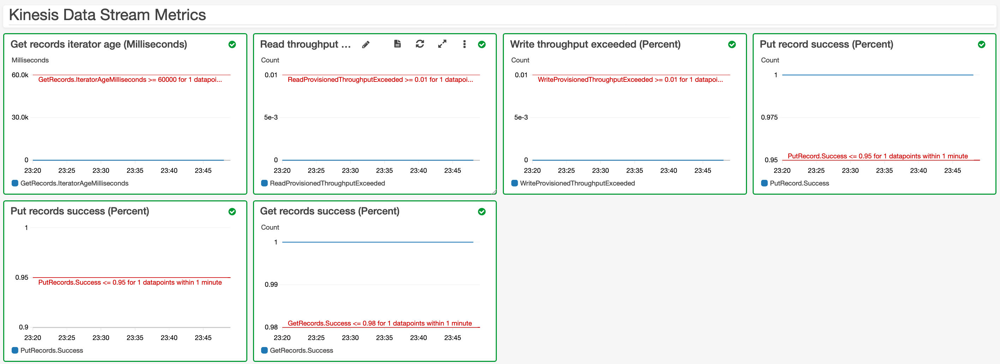
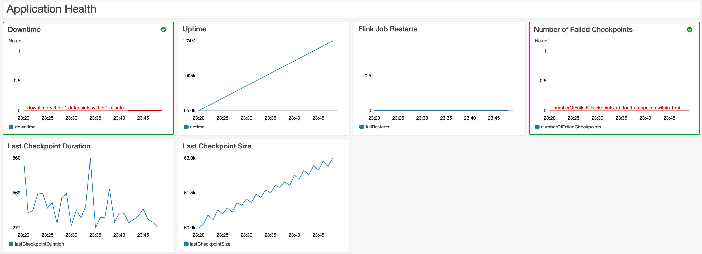
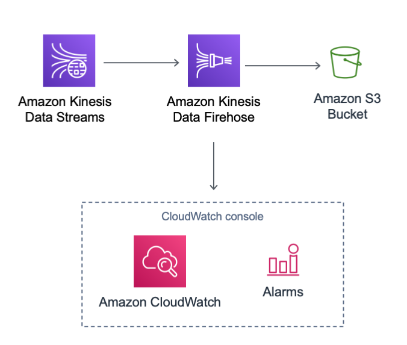
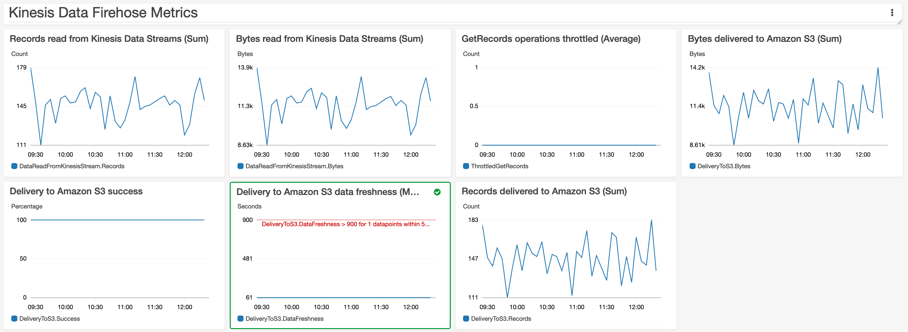
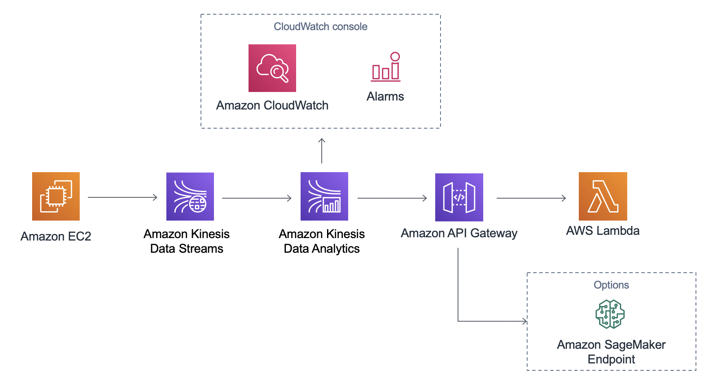

## Architecture for AWS Streaming Data Solution for Amazon Kinesis
The solution implements four patterns with more coming soon. All of them use Amazon Kinesis Data Streams for streaming storage, and you can combine and extend the different components (which are built using the AWS CDK) to meet your needs.

### 1st pattern


The first pattern includes an API Gateway REST API that acts as proxy to Kinesis; an Amazon Kinesis Data Stream that stores the data records; an AWS Lambda function that processes records from the data stream; and an Amazon SQS queue that stores metadata about failed records. Also included are [Amazon CloudWatch alarms](https://docs.aws.amazon.com/streams/latest/dev/monitoring-with-cloudwatch.html#kinesis-metric-use) and a dashboard to monitor the data stream health.



### 2nd pattern


The second pattern includes an EC2 instance that generates data using the Kinesis Producer Library; an Amazon Kinesis Data Stream that stores the data records; an Amazon Kinesis Data Analytics application that process the incoming records and saves data to an Amazon S3 bucket. Also included are [Amazon CloudWatch alarms](https://docs.aws.amazon.com/kinesisanalytics/latest/java/monitoring-metrics-alarms.html#monitoring-metrics-alarms-recommended) and a dashboard to monitor the application health / progress, resource utilization, and specific events / errors.



The solution provides a [demo producer application](/source/kinesis/kpl-demo), which is configured to write 100 records per second to the data stream. There's also a [demo Java application for Kinesis Data Analytics](/source/kinesis/kda-flink-demo), in order to demonstrate how to use Apache Flink sources, sinks, and operators. The schema used is the same one provided in [Getting Started with Amazon Kinesis Data Analytics](https://docs.aws.amazon.com/kinesisanalytics/latest/java/getting-started.html):

```json
{
    "EVENT_TIME": "2020-08-01T12:00:00.000Z",
    "TICKER": "AMZN",
    "PRICE": 50
}
```

By default, the demo producer and consumer applications will not run after the stacks are created. To enable them, follow the steps below:

#### 1. Start the Kinesis Data Analytics application
> **Note**: Application name is an output of the CloudFormation stack.

```
aws kinesisanalyticsv2 start-application --application-name <application-name> --run-configuration {}
```

#### 2. Start the KPL producer
> **Note**: This command needs to be run from the EC2 instance launched as part of the stack.

> **Note**: Stream name is an output of the CloudFormation stack.

```
sudo java -jar /tmp/aws-kpl-demo.jar <stream-name> <aws-region> <seconds-to-run>
```

### 3rd pattern


The third pattern includes an Amazon Kinesis Data Stream that stores the data records; an Amazon Kinesis Data Firehose delivery stream that buffers data before delivering it to the destination; and an Amazon S3 bucket that stores the output. Also included are [Amazon CloudWatch alarms](https://docs.aws.amazon.com/firehose/latest/dev/monitoring-with-cloudwatch-metrics.html#firehose-cloudwatch-metrics-best-practices) and a dashboard to monitor the delivery stream health.



### 4th pattern


The fourth pattern is similar to the second pattern, but it showcases how to (asynchronously) invoke an external endpoint in a streaming application, which is useful when you want to enrich or filter incoming events. By default, the solution will use a Lambda function, but that can be replaced by any integration supported by API Gateway (such as an [Amazon SageMaker endpoint](https://docs.aws.amazon.com/solutions/latest/constructs/aws-apigateway-sagemakerendpoint.html)).

The solution provides a [demo producer application](https://github.com/aws-samples/amazon-kinesis-replay), which will replay events from an [existing dataset](https://registry.opendata.aws/nyc-tlc-trip-records-pds/) to the data stream. There's also a [demo Java application for Kinesis Data Analytics](/source/kinesis/kda-flink-ml), in order to demonstrate how to the [Asynchronous I/O API of Apache Flink](https://ci.apache.org/projects/flink/flink-docs-stable/dev/stream/operators/asyncio.html).

By default, the demo producer and consumer applications will not run after the stacks are created. To enable them, follow the steps below:

#### 1. Start the Kinesis Data Analytics application
> **Note**: Application name is an output of the CloudFormation stack.

```
aws kinesisanalyticsv2 start-application --application-name <application-name> --run-configuration {}
```

#### 2. Start the producer
> **Note**: This command needs to be run from the EC2 instance launched as part of the stack.

> **Note**: Stream name is an output of the CloudFormation stack.

```
sudo java -jar /tmp/amazon-kinesis-replay-0.1.0.jar -streamName <stream-name> -streamRegion <region> -noWatermark -objectPrefix artifacts/kinesis-analytics-taxi-consumer/taxi-trips-partitioned.json.lz4/dropoff_year=2018/
```
