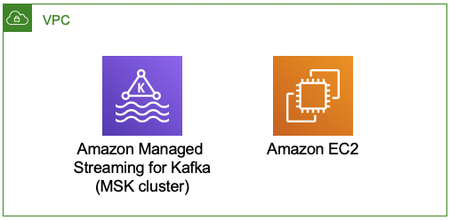
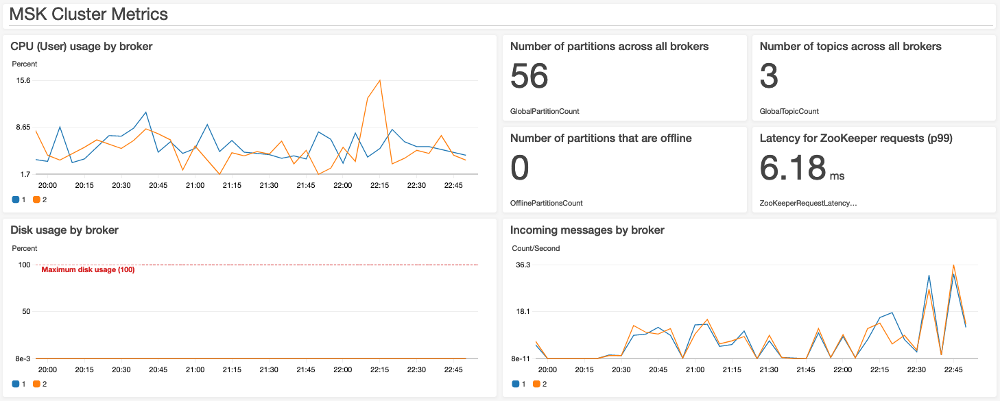
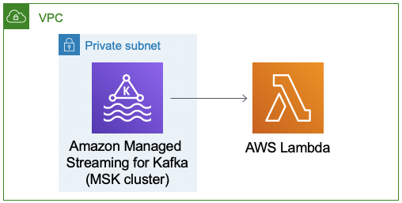

## Architecture for Architecture for AWS Streaming Data Solution for Amazon MSK
The solution implements three patterns with more coming soon. All of them use Amazon MSK for streaming storage, and you can combine and extend the different components (which are built using the AWS CDK) to meet your needs.

### 1st pattern


The first pattern includes an Amazon MSK cluster and Amazon EC2 instance that contains the Apache Kafka client libraries required to communicate with the MSK cluster (this client machine will be located on the same Amazon VPC as the cluster, and it can be accessed via AWS Systems Manager Session Manager). Also included is an Amazon CloudWatch dashboard to monitor the cluster health.



Once the stack is launched, you can use the client instance to create an Apache Kafka topic and produce data.

> **Note**: The following commands need to be run from the EC2 instance launched as part of the stack.

> **Note**: Cluster ARN is an output of the CloudFormation stack.

#### 1. Query ZooKeeper connection and Bootstrap servers
Run the _describe-cluster_ CLI command and save the value for the _ZookeeperConnectString_ property:
```
aws kafka describe-cluster --cluster-arn <cluster-arn> --region <aws-region>
```

Run the _get-bootstrap-brokers_ CLI command and save the value for the _BootstrapBrokerStringTls_ property:
```
aws kafka get-bootstrap-brokers --cluster-arn <cluster-arn> --region <aws-region>
```

#### 2. Create topic and produce data
> **Note**: If the command returns an _InvalidReplicationFactorException_, make sure the _replication-factor_ parameter is not larger than the number of available brokers.

```
sudo su
cd /home/kafka/bin

./kafka-topics.sh --create --zookeeper <ZookeeperConnectString> --replication-factor 2 --partitions 1 --topic MyTopic
./kafka-topics.sh --list --bootstrap-server <BootstrapBrokerStringTls> --command-config client.properties
./kafka-verifiable-producer.sh --bootstrap-server <BootstrapBrokerStringTls> --producer.config client.properties --topic MyTopic --throughput 100 --max-messages 500
```

> **Note**: For the following 2 patterns, the topic must exist before the stack is launched. If it doesn't, Lambda will not be able to process any events.

### 2nd pattern


The second pattern includes an AWS Lambda function that consumes data from an Apache Kafka topic. The [function](/source/lambda/msk-lambda-consumer/index.js) is a Node.js application that logs the received messages, but it can be customized to your business needs.

### 3rd pattern


The third pattern includes an AWS Lambda function that consumes data from an Apache Kafka topic; an Amazon Kinesis Data Firehose delivery stream that buffers data before delivering it to the destination; and an Amazon S3 bucket that stores the output. The [function](/source/lambda/msk-lambda-kdf/index.js) will propagate the messages to Amazon S3 for backup and long term storage.
